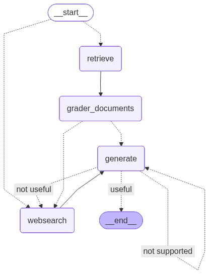

# Graph-Orchestrated Adaptive RAG System

## Overview

This project implements a graph-orchestrated Retrieval-Augmented Generation (RAG) system with dynamic routing, document grading, and hallucination detection.

Instead of using a linear pipeline (Retrieve → Generate), this architecture introduces:

- Retrieval relevance grading
- Hallucination detection
- Answer validation
- Conditional branching
- Web search fallback
- Graph-based execution flow

The goal is to improve reliability and reduce unsupported or hallucinated responses.
This architecture prioritizes reliability, controllability, and answer traceability — addressing core weaknesses of traditional linear RAG pipelines.

---

## Architecture

The system is built as a conditional execution graph.

Flow:

Start  
→ Retrieve  
→ Grade Documents  
→ (Useful?)  
  → Yes → Generate  
  → No → Web Search → Generate  

After generation:
→ Hallucination Grader  
→ Answer Grader  
→ (Supported?)  
  → Yes → End  
  → No → Retry / Route

Architecture diagram:




---
## Project Structure
```text
RAG/
│
├── graph/
│   ├── chains/
│   │   ├── answer_grader.py
│   │   ├── generation.py
│   │   ├── hallucination_grader.py
│   │   ├── retrieval_grader.py
│   │   └── router.py
│   │
│   ├── nodes/
│   │   ├── generate.py
│   │   ├── grader_documents.py
│   │   ├── retrieve.py
│   │   └── web_search.py
│   │
│   ├── graph.py
│   └── state.py
│
├── ingestion.py
├── main.py
├── graph.png
└── requirements.txt

## Core Components

### graph/chains/

Contains LLM-driven evaluators and generation logic:

- `retrieval_grader.py` → Evaluates relevance of retrieved documents  
- `hallucination_grader.py` → Detects unsupported claims  
- `answer_grader.py` → Validates final answer quality  
- `generation.py` → Handles LLM response generation  
- `router.py` → Determines next execution path  

---

### graph/nodes/

Defines executable graph nodes:

- `retrieve.py` → Document retrieval  
- `grader_documents.py` → Relevance grading  
- `generate.py` → Answer generation  
- `web_search.py` → External search fallback  

---

### graph.py

Defines graph transitions and conditional routing logic.

---

### state.py

Maintains shared state across graph execution.

---

### ingestion.py

Handles document loading, chunking, embedding, and indexing.

---

## Key Features

- Graph-based orchestration
- Self-correcting RAG flow
- Hallucination detection
- Adaptive routing
- Modular node design
- Separation of chains and execution nodes

---

## Technologies

- Python
- LLM integration
- Embeddings
- Conditional graph execution logic

---

## Acknowledgment

This project was inspired by a RAG architecture tutorial.  
The implementation, extensions, and architectural adaptations were developed independently to explore graph-based adaptive RAG systems.

---
